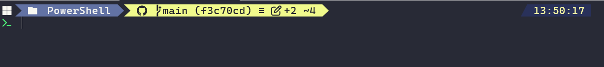
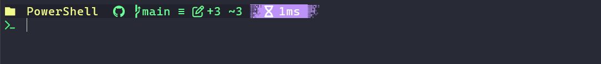
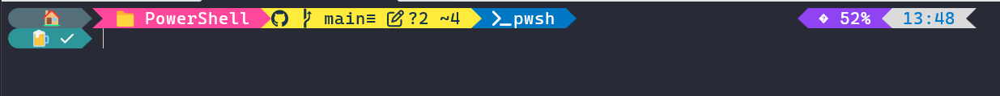

# Meus temas do om-my-posh

Esse repo contém uma pequena coleção de temas que eu uso no meu oh-my-posh. 

### crazy-diamond

### jef-simple

### Shellmoji

## Mapa de cores

Mapeamento dos nomes das cores do OMP para o Windows Terminal

| oh-my-posh        | Windows Terminal  | ANSI  | 
| ----------        | ----------------  | ---:  | 
| black             | black             | 30    |
| red               | red               | 31    |
| green             | green             | 32    |
| yellow            | yellow            | 33    |
| blue              | blue              | 34    |
| magenta           | purple            | 35    |
| cyan              | cyan              | 36    |
| white             | white             | 37    |
| darkGray          | brightBlack       | 90    |
| lightRed          | brightRed         | 91    |
| lightGreen        | brightGreen       | 92    | 
| lightYellow       | brightYellow      | 93    |
| lightBlue         | brightBlue        | 94    |
| lightMagenta      | brightPurple      | 95    |
| lightCyan         | brightCyan        | 96    |
| lightWhite        | brightWhite       | 97    | 
| transparent       |                   |       |
| default           |                   |       |
| foreground        |                   |       | 
| background        |                   |       |
| parentForeground  |                   |       |
| parentBackground  |                   |       |
| accent            |                   |       |

## Documentações

- https://ohmyposh.dev/docs/configuration/colors
- https://learn.microsoft.com/en-us/windows/terminal/customize-settings/color-schemes